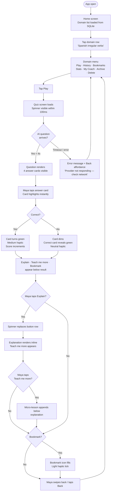
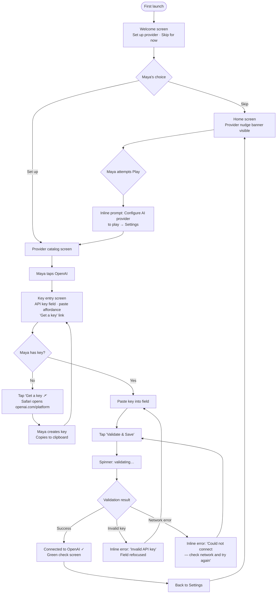
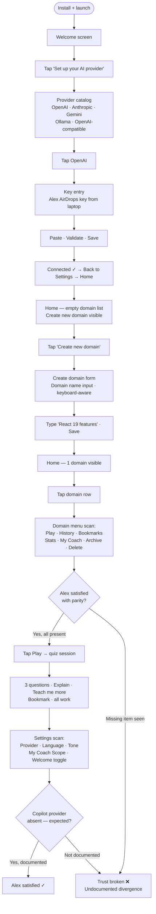
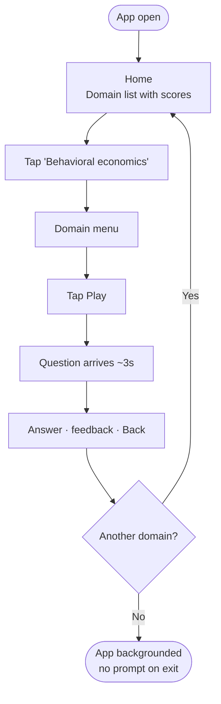

# UX Design Specification brain-break (Mobile)

**Author:** George
**Date:** 2026-04-25

---

## Executive Summary

### Project Vision

Brain Break Mobile brings the complete Brain Break terminal experience to iOS
and Android. It is not a companion app or a lite edition — it is the same
product on a new surface, for a persona who doesn't live in a terminal.

The guiding principle, locked in product planning:
> *Brain Break Mobile is the same product as Brain Break Terminal, on a new
> surface. Same features, same names, same menu locations, same mental model.
> Only input (thumbs vs keyboard) and rendering (pixels vs ANSI) change.*

Phase 1 delivers full feature parity across all 15 MVP surfaces. Every
omission is either platform-forced (no Exit, no GitHub Copilot) or explicitly
committed to the backlog (Challenge mode, ASCII art milestones, sync). Users
will never hear "that's a desktop feature."

### Target Users

**Maya Reyes — Primary Persona**
32, marketing lead, non-developer. Opens the app 3–5 times a day in short
bursts — commute, coffee queue, the minute between meetings. Values *showing
up* over completing. Has churned from streak-driven apps (Duolingo), long-form
courses (Coursera), and passive saves (Medium). She needs a tool that respects
30 seconds, asks nothing more, and never manipulates her attention.

Maya's definition of a successful session: one answered question, one
explanation or deeper lesson, one tap to bookmark. 90 seconds. Done.

**Alex Park — Secondary Persona**
34, full-stack engineer, long-time terminal user. Installed mobile on launch
day to verify it's the real product. He will notice every missing feature.
His trust is maintained only through complete feature parity and transparent,
pre-documented divergences. He is a free word-of-mouth acquisition channel
if and only if the parity promise holds.

### Key Design Challenges

1. **Translating terminal navigation to touch.** The terminal's arrow-key
   select model must become tap targets, native stack transitions, and a Back
   gesture — without losing the mental model of linear push/pop navigation
   that power users like Alex already know.

2. **Preserving focus-tool identity on an attention-hungry platform.** Mobile
   is the most distraction-dense surface there is. Brain Break's soul —
   dark, glanceable, ambient, zero upsell — must be actively enforced at
   every design decision, not assumed. No bottom tabs (they invite browsing).
   No notifications by default. No gamification beyond what the terminal
   already has.

3. **The onboarding tension: explore first vs. configure first.** AI features
   require a BYO key. Maya may install without one. The UX must let her
   explore the full structure of the app before committing to setup, while
   making it obvious when she hits the AI wall — and making the path forward
   feel empowering, not punishing.

4. **AI latency in a glanceable app.** Question generation is p50 <4s,
   p95 <8s. In a 90-second session, 4 seconds is a meaningful fraction of
   Maya's time. Loading states must be immediate (≤100ms), non-blocking (she
   can navigate back while waiting), and honest (no false progress bars).

5. **Zero-state Home.** Maya's first session and Alex's first session both
   begin with an empty domain list. The zero-state screen must guide users
   clearly to Create domain without feeling sparse or confusing.

### Design Opportunities

1. **Haptics as a uniquely mobile feedback mechanism.** The terminal can't
   buzz. A correct-answer haptic tick, a bookmark-confirmation tap, a subtle
   error pulse — these are a new expressive layer unavailable on terminal
   that can make sessions feel more viscerally rewarding without adding
   visual noise.

2. **Keyboard-aware form design.** Domain creation, key entry, and provider
   setup all require text input. Well-executed keyboard-aware layouts (fields
   that slide above the keyboard, clear paste affordances) make setup feel
   effortless — especially for the BYO-key flow where Maya will be
   paste-from-clipboard on her phone.

3. **Latency-tolerant quiz design.** Because AI calls are cancellable and
   the stack navigator supports back navigation while loading, the quiz can
   be genuinely non-blocking. This lets Maya hit Back and start a different
   domain mid-load — a behaviour terminal users already expect, now first-
   class on mobile.

---

## Core User Experience

### Defining Experience

The core loop of Brain Break Mobile is a micro-learning cycle designed to
complete in under 90 seconds:

1. **Open** — Home loads instantly from local SQLite. Domain list is visible
   in under 2 seconds, even cold-start.
2. **Select domain** — One tap from Home to Domain menu.
3. **Play** — One tap from Domain menu to quiz. AI question arrives in
   p50 <4s with a non-blocking loading state visible within 100ms.
4. **Answer** — User taps one of four options. Haptic + visual feedback
   within milliseconds. Score and streak update immediately.
5. **Go deeper (optional)** — Explain and Teach me more are available inline
   after every answer. Each is a single tap. AI response arrives in p50 <4s.
6. **Bookmark (optional)** — Single tap. Haptic confirmation. Persisted
   immediately to local SQLite.
7. **Exit or continue** — User navigates back at any point. Back gesture
   always works, even during an in-flight AI call.

This loop is the entire product. Every other screen exists to serve or
extend it.

### Platform Strategy

**Target surfaces:** iOS 16.0+ and Android 10 (API 29)+. Phones only.
Portrait only. No tablets, no landscape, no web.

**Navigation model:** Stack navigator via expo-router. This mirrors the
terminal's linear push/pop router model exactly — every screen pushes onto
the stack; Back pops it. No tab bar. No bottom navigation. Browsing and
discovery are not the product's purpose; focused task execution is.

**Input model:** Touch-first throughout. No keyboard shortcuts, no swipe
gestures for primary actions (swipe is reserved for system Back on Android
and iOS edge swipe). All primary actions are explicit taps on clearly labelled
targets. Paste-from-clipboard is the primary text-input affordance in the
BYO-key setup flow.

**Offline behaviour:** Home, History, Bookmarks, and Stats work fully offline
from local SQLite. AI-bound actions (Play, Explain, Teach me more, My Coach)
require network; attempting them offline shows a clear, non-blocking error
that routes the user back without losing their place.

**Platform-exclusive affordances used:**
- `expo-haptics` — impact and notification haptics on correct/incorrect
  answers, bookmark toggles, and error states.
- `expo-secure-store` — API keys live exclusively in Keychain (iOS) /
  Keystore (Android). Never in SQLite, AsyncStorage, or logs.
- `expo-linking` — Buy me a coffee opens in the system browser, not an
  in-app WebView.
- System keyboard awareness — all text input screens adjust layout to keep
  the active field visible above the keyboard.

### Effortless Interactions

These interactions must require zero thought and zero friction:

1. **Starting a session.** Home → tap domain → tap Play. Two taps maximum
   from app open to first question on screen (loading state inclusive).
   There must be no confirmation dialogs, no interstitials, no "are you
   ready?" screens.

2. **Answering a question.** Four large tap targets fill the answer area.
   No double-tap required, no confirmation. Tapping an option is the answer.
   Haptic and visual response is immediate — the user never wonders if their
   tap registered.

3. **Going deeper.** Explain and Teach me more appear as tappable actions
   directly below the answer feedback. No navigation required; content loads
   inline in the same screen. One tap, stays in context.

4. **Bookmarking.** A bookmark icon is always present after answering. Tap
   once to toggle. Filled icon = saved. Haptic tick confirms. No confirmation
   dialog, no undo prompt.

5. **Navigating back.** Back is always available via the native back gesture
   (iOS edge swipe / Android back gesture) or a visible back button in the
   navigation header. This includes mid-AI-call — cancelling a request and
   returning to the previous screen must be instantaneous.

6. **Pasting an API key.** The provider-key input screen must show a
   prominent "Paste" affordance. On iOS, the system paste dialog should
   trigger automatically when the field is focused if clipboard content
   looks like a key. On Android, the paste button in the keyboard toolbar
   suffices.

### Critical Success Moments

1. **First haptic buzz on a correct answer.** This is Maya's introduction to
   the mobile-native layer of the product. It must feel satisfying, not
   jarring — a medium impact haptic, not a notification buzz. This moment
   differentiates mobile from terminal more than any visual change.

2. **The Explain response arrives while she's still on the train platform.**
   If Explain takes longer than her attention span (>6s in a distracting
   environment), she navigates away. The loading state must be encouraging
   (animated, clearly in-progress), and the response must not feel like it
   required patience.

3. **Alex scans the Domain menu and sees everything.** Play · History ·
   Bookmarks · Stats · My Coach · Archive · Delete. Every item present, same
   order as terminal. This single scan either confirms the parity promise or
   breaks his trust permanently.

4. **Provider setup completes with a green check.** After Maya pastes her
   key and the validation call returns successfully, the "Connected to
   OpenAI ✓" confirmation is the moment she becomes an active user. The
   path from no-provider to configured must feel achievable in under
   5 minutes, mostly spent on OpenAI's own site.

5. **Session end without a single nag.** No "rate us," no "invite a friend,"
   no "upgrade to premium," no streak warning. Maya pockets her phone. The
   app did its job and got out of the way. This moment of non-event is, for
   this product, a success moment.

### Experience Principles

1. **Two taps to value.** Any user should reach their first question within
   two taps of opening the app (after initial setup). Navigation depth is
   a product quality metric.

2. **Never block, always route.** No dead ends. Every error state, empty
   state, and configuration gap has a clear, single forward path. The app
   never leaves the user stranded.

3. **Earn attention, don't demand it.** Loading states are immediate and
   honest. No false progress bars. No "hang on, generating your question..."
   that sits for 10 seconds. If the AI is slow, the UI reflects that
   truthfully and keeps Back reachable.

4. **The terminal mental model is the mobile mental model.** Screen names,
   feature names, menu order, and flows map 1:1 to the terminal version.
   Alex should be able to navigate the mobile app by memory. Maya will learn
   the same mental model that Alex has — the product doesn't have two
   personalities.

5. **Mobile-native enhancements are additive, never substitutive.** Haptics,
   keyboard awareness, system browser links, and native transitions make
   the mobile experience richer than terminal — but they never replace the
   core interaction model. A feature that works without haptics must work
   with them too; haptics are an enhancement, not a dependency.

---

## Desired Emotional Response

### Primary Emotional Goals

**For Maya (primary):** *Calm accomplishment.* She closed the app feeling
like she spent her time well — not like she was played. The emotional reward
is quiet and intrinsic: she got one thing right, learned something behind it,
and marked it for later. No confetti. No streak counter ticking up. Just the
clean feeling of having used a spare moment well.

**For Alex (secondary):** *Respectful validation.* The mobile app confirms
what he believed — that the team didn't compromise. The emotion is not
delight or surprise; it is trust confirmed. He expected parity; he got it.
That reliability is the emotional payoff.

**For both:** *In control.* The app does what they ask and nothing more. It
does not push them toward longer sessions, ask them to share their results,
or interrupt them with prompts. Being in control is itself an emotional
reward on a platform saturated with apps that fight for attention.

### Emotional Journey Mapping

**First discovery (install + first open):**
Target emotion: *Curious, not committed.* The Welcome screen should intrigue
without pressuring. Maya should feel free to poke around without having made
any promises. The Skip option on provider setup is critical — it signals
that the app respects her on the first screen she sees.

**During the core loop (Play → Answer → Feedback):**
Target emotion: *Focused flow.* The screen is dark, the question fills the
space, the options are clear. There is nothing else competing for her
attention. For 30 seconds she is entirely in the question. This is the same
feeling as a well-designed physical quiz game — absorbed, not stressed.

**After a correct answer:**
Target emotion: *Small, honest satisfaction.* Not euphoria — that would ring
false after a single multiple-choice question. The haptic tick and a clean
visual confirmation say "yes, that was right." The emotion is the same as
ticking a checkbox: small, real, accumulating.

**After an incorrect answer:**
Target emotion: *Curious, not ashamed.* The wrong-answer feedback should
not feel punitive. The visual is matter-of-fact; the correct answer is
shown clearly. The natural follow-up is "so why was it X?" — and the
Explain button is right there. Failure is a learning trigger, not a
shame moment.

**After Explain / Teach me more:**
Target emotion: *Genuine understanding.* The explanation is not a summary
she already knew. It connects the right answer to something deeper. The
feeling is a small click of comprehension — the same feeling as a good
teacher's answer to "but why?"

**After a session ends:**
Target emotion: *Quiet satisfaction, no residue.* Maya pockets her phone.
She did not receive a prompt to rate the app, share her score, or maintain
a streak. The app asked nothing of her on the way out. The absence of
manipulation is itself a feeling — relief, trust, the sense of being
treated like an adult.

**When something goes wrong (network error, slow AI, invalid key):**
Target emotion: *Informed, not helpless.* Error states must be honest and
specific. "AI provider not responding — check your network and try again"
is better than a spinner that hangs. The user understands what happened and
has a clear path forward. Frustration is acceptable; confusion is not.

### Micro-Emotions

| Moment | Desired emotion | Avoided emotion |
|---|---|---|
| First app open | Curious, uncommitted | Overwhelmed, obligated |
| Correct answer + haptic | Small satisfaction | Hollow euphoria |
| Incorrect answer | Curious ("why?") | Shame, discouragement |
| Explain response arrives | Understanding, engaged | Impatient, confused |
| Bookmark saved | Ownership ("mine") | Indifference |
| Provider setup complete | Capable, self-sufficient | Dependent, surveilled |
| Session end, no nag | Trusted, respected | Nagged, manipulated |
| Feature parity scan (Alex) | Trust confirmed | Betrayal, disappointment |
| Error state | Informed, in control | Helpless, abandoned |

### Design Implications

1. **Calm accomplishment → no confetti, no streaks on session end.**
   The post-answer feedback is clean: green check or red X, correct answer
   revealed, score delta shown. No animation that oversells the moment.
   No streak counter visible during play — streaks exist in Stats, not in
   the quiz flow.

2. **Focused flow → dark screen, zero chrome during quiz.**
   During an active question, the only visible elements are the question
   text, four answer options, a timer, and a score. No navigation header.
   No domain name banners. No floating action buttons. The screen is the
   question.

3. **Curious not ashamed → incorrect answer feedback is factual, not
   punitive.** Wrong answer: the selected option dims slightly, the correct
   option highlights calmly, and the Explain button becomes prominent. No
   buzzing haptic on wrong answers (buzzing = punishment). Use a soft
   neutral haptic instead — acknowledgement, not judgment.

4. **Trusted, respected → no nag screens, ever.** No "enjoying Brain Break?
   Rate us." No "share your score." No streak warning on session exit. The
   app ends when the user decides it ends — no friction on the way out.

5. **Informed not helpless → error states name the problem.** Every error
   message has three parts: what happened, why it likely happened, what
   to do next. Loading states have a cancel / Back affordance visible within
   3 seconds if the call hasn't resolved. Never a spinner with no exit.

6. **Correct-answer haptic is medium impact, not notification.**
   `expo-haptics` `ImpactFeedbackStyle.Medium` for correct answers.
   `ImpactFeedbackStyle.Light` for bookmark toggle confirmation. No haptic
   for incorrect answers (avoid the punishment association). No haptic for
   navigation (avoid noise).

### Emotional Design Principles

1. **Respect is the product.** Every screen that could have added a nag,
   an upsell, a social prompt, or a manipulation pattern — and didn't —
   is an active design choice that earns emotional trust. Document the
   absences as deliberately as the presences.

2. **The haptic vocabulary is small and meaningful.** Each haptic pattern
   maps to exactly one meaning. Medium impact = correct. Light = bookmark
   confirmed. No haptic = incorrect / navigation. If every action buzzes,
   nothing means anything.

3. **Failure is a doorway, not a wall.** Wrong answers, AI errors, and
   configuration gaps are all presented as transitions to something — the
   explanation, the retry, the settings screen. The UI never communicates
   "you're stuck here"; it always communicates "next, you can..."

4. **Small, real rewards over large, hollow ones.** The emotional payoff of
   a correct answer is proportional to the effort — it's one question, not
   a course completion. Design the feedback to feel appropriately sized:
   satisfying, not over-the-top. Users calibrate their trust in feedback
   by whether it matches their actual achievement.

---

## UX Pattern Analysis & Inspiration

### Inspiring Products Analysis

**Brain Break Terminal (primary reference)**
The strongest single reference for the mobile UX. The terminal version has
earned its users through restraint: no accounts, no streaks, no upsell,
linear navigation, honest feedback. The mobile design's job is not to
reinvent this — it is to translate it faithfully to touch.

What it does well: linear push/pop navigation maps cleanly to a stack
navigator; every screen has one primary action; error states are informative
and route the user back; the absence of gamification pressure is
conspicuous and intentional. All of this carries over to mobile unchanged.

What mobile improves on: haptic feedback replaces ANSI colour as the
immediate-response layer; native transitions replace screen clears; keyboard-
aware layouts replace terminal's implicit line-by-line flow.

---

**Wordle / NYT Games**
Single-interaction loop, dark default, no account required, no streak
anxiety (Wordle shows your streak but never punishes you for breaking it),
honest feedback on every answer, no upsell, minimal chrome. A full session
takes 2–5 minutes with zero friction.

Transferable patterns:
- Large, well-spaced tap targets for answer selection (Wordle's letter grid)
- Immediate, unambiguous visual feedback on correct/incorrect (green/yellow/grey)
- Understated session-end: a simple result summary with no pressure to share
- Clean empty-state: "Come back tomorrow" is not a nag — it's a natural end

Anti-patterns to note: Wordle's share mechanic (emoji grid) is viral but
optional; Brain Break has no share mechanic at all — not even optional.

---

**Duolingo (anti-inspiration)**
Explicitly cited in the PRD as what Maya churned from. It represents the
emotional failure mode Brain Break must avoid: streak anxiety, push
notifications framed as guilt, hearts-as-lives that block play, a constant
undercurrent of "you might lose your progress."

What to actively avoid:
- Streak counters visible during active play
- Any prompt to "keep your streak alive" on session exit
- Progress mechanics that feel punishing when broken
- Push notifications framed as motivational (any push notifications, Phase 1)
- A "lives" or energy system of any kind

Duolingo's interaction patterns for answering (large tap targets, immediate
colour feedback) are fine and widely understood — the issue is the motivation
layer, not the quiz mechanics.

---

**Linear (focus-tool design reference)**
Not an edtech app but one of the cleanest examples of a dark-first, keyboard-
aware, no-chrome productivity tool that respects expert users. Relevant for
Brain Break's secondary persona (Alex).

Transferable patterns:
- Dark background as the default, not the "pro" option
- Dense information display without feeling cramped — good typography carries
  a lot of information cleanly
- Navigation that is always one step away (back is always visible and fast)
- Errors and empty states that are dry and informative, never apologetic

---

**Mimo / Codecademy Go (mobile learning anti-patterns)**
Both are mobile coding-education apps that over-gamified their core
experience: XP bars, level-up animations, daily challenges with time gates.
The quiz interaction itself (tap to answer, see feedback) is well-executed
in both — but the motivation layer is exactly what Brain Break is not.

Transferable from the interaction layer:
- Bottom-sheet style inline explanations after a question (keeps context)
- Answer options as full-width tappable cards, not radio buttons
- Inline correctness feedback that doesn't navigate away from the question

Anti-patterns to avoid from the motivation layer:
- XP bars, level counters, achievement badges
- "You're on a roll!" overlays after consecutive correct answers
- Any animation that delays the user's ability to tap the next action

### Transferable UX Patterns

**Navigation Patterns:**
- Stack push/pop only — every screen has one entry and one exit (Back).
  Inherited from terminal; reinforced by Wordle and Linear's single-depth
  navigation model.
- No persistent tab bar — the domain list on Home is the navigation hub.
  Reaching any feature is: Home → tap domain → tap feature. Three taps max.

**Interaction Patterns:**
- Full-width tappable cards for answer options (Mimo/Codecademy Go reference).
  No radio buttons, no checkboxes — the card *is* the tap target.
- Inline feedback: correct/incorrect result, explanation, and teach-me-more
  all render in the same screen without pushing a new route.
- Immediate visual response on tap (highlight the selected card instantly,
  before the answer is evaluated) — eliminates "did my tap register?" doubt.
- Bottom-affixed primary action buttons for flows with a single next step
  (e.g., "Continue to next question", "Save and return").

**Visual Patterns:**
- Dark background (#0a0a0a or equivalent terminal token) as the universal
  canvas — never a light mode fallback in Phase 1.
- High-contrast answer cards: unselected cards use a subtle border/dim
  treatment; correct answer highlights in brand green; incorrect answer
  dims with correct answer revealed in green.
- Minimal navigation chrome during quiz — no visible header bar while a
  question is active. Back accessible via system gesture only.
- Loading states: a simple animated indicator (activity indicator or pulsing
  skeleton) centred in the content area, with a visible Back button beneath
  it after 2 seconds.

### Anti-Patterns to Avoid

1. **Streak visibility during active play.** Streaks belong in Stats only.
   Seeing "🔥 12 day streak" while trying to answer a question shifts
   the emotional frame from learning to performance anxiety.

2. **Celebratory overlays on correct answers.** Confetti, "Amazing!", bouncing
   stars — these inflate small moments and wear out quickly. Brain Break's
   emotional register is quieter than that.

3. **Hard gates on AI configuration.** Maya must be able to reach Home
   without configuring a provider. Any flow that blocks navigation until
   setup is complete will cause immediate churn for users who want to
   explore first.

4. **Full-screen loading states with no Back.** A spinner that covers the
   whole screen and removes Back is a trap. AI calls can be slow; the user
   must always be able to escape.

5. **Answer options as small radio buttons or text-only lists.** On a phone,
   small tap targets on text-only answer lists cause mistaps and feel dated.
   Full-width cards are the established mobile quiz pattern.

6. **Navigation headers during quiz.** A domain name header and a back-
   chevron visible while reading a question fragment attention. During active
   play, the question owns the screen.

### Design Inspiration Strategy

**What to adopt directly:**
- Full-width tappable answer cards (Mimo/Codecademy Go)
- Stack-only navigation with no persistent tab bar (terminal + Wordle mental
  model)
- Understated session-end: result summary, no pressure to continue or share
- Dark-first palette lifted directly from terminal colour tokens

**What to adapt:**
- Wordle's immediate colour feedback → adapt to Brain Break's green/red
  palette and add haptic layer unavailable in Wordle
- Linear's information density → adapt to Brain Break's simpler content
  (fewer data points per screen, larger type for glanceability)
- Terminal's screen-clear-on-navigate → adapt to native stack transition
  (slide-in/slide-out), preserving the "fresh context" feeling of a screen
  clear without the ANSI flash

**What to avoid entirely:**
- Duolingo's streak/heart/energy motivation layer
- Mimo's XP bar and level-up animation
- Any modal that requires explicit dismissal before the user can navigate
- Any prompt to rate, share, or invite after a session

---

## Design System Foundation

### Design System Choice

**Custom token-based design system built on React Native primitives.**

Brain Break Mobile does not adopt an established third-party component
library (Material Design, Ant Design, MUI, NativeBase, etc.). Instead:

- A `theme.ts` tokens file in `packages/mobile` defines all colour, spacing,
  typography, and shadow values as a single source of truth.
- All UI components are custom-built, thin wrappers around React Native
  core primitives (`View`, `Text`, `Pressable`, `ScrollView`, etc.).
- The tokens file is architected for a single-file swap to support light /
  high-contrast modes in a future phase — dark-only for Phase 1.
- Colour tokens are lifted directly from the terminal app's existing ANSI
  palette and adapted to React Native hex values.

### Rationale for Selection

1. **NFR-M5 compliance.** The architecture mandates ≤15 direct runtime
   dependencies beyond Expo core. A component library like NativeBase or
   MUI would immediately violate this constraint. Custom primitives add
   zero runtime dependencies.

2. **Brand fidelity.** Brain Break has a strong, established visual identity
   from the terminal version: specific colour tokens, the 🧠🔨 header motif,
   gradient shadow bars, and a dark-first aesthetic. An established design
   system would need heavy theming overrides to match this — equivalent work
   to building custom, with more maintenance surface.

3. **Screen simplicity.** Brain Break Mobile's 15 MVP surfaces are
   compositionally simple: lists, cards, text blocks, single-input forms,
   and a quiz screen. There are no complex data grids, date pickers, or
   rich text editors that would justify a full component library's breadth.

4. **Phase 2 design-system readiness.** A `theme.ts` token file means a
   future light mode or high-contrast mode is a one-file flip with zero
   component changes — cleaner than fighting an adopted system's theming.

5. **Terminal parity as design spec.** The existing terminal UX specification
   is itself the design reference. Custom components derived from that spec
   are more literal and auditable than theming an established system.

### Implementation Approach

**Token layer (`packages/mobile/src/theme.ts`):**

```ts
export const colors = {
  background:          '#0a0a0a',
  surface:             '#111111',
  surfaceElevated:     '#1a1a1a',
  border:              '#2a2a2a',
  textPrimary:         '#e5e5e5',
  textSecondary:       '#888888',
  textDim:             '#555555',
  correct:             '#4ade80',   // green  — terminal colorCorrect
  incorrect:           '#f87171',   // red    — terminal colorIncorrect
  accent:              '#a78bfa',   // violet — terminal brand accent
  warning:             '#fbbf24',   // amber  — provider nudge
  brandGradientStart:  '#06b6d4',   // cyan   — terminal gradient
  brandGradientEnd:    '#a855f7',   // purple — terminal gradient
} as const;

export const spacing  = { xs: 4, sm: 8, md: 16, lg: 24, xl: 32 } as const;
export const fontSize = { xs: 11, sm: 13, md: 16, lg: 20, xl: 28 } as const;
export const radius   = { sm: 6, md: 10, lg: 16 } as const;
```

**Component layer (thin custom wrappers — 16 components total, defined in §Component Strategy):**
- `<Screen>` — safe-area aware scroll container with standard background
- `<Card>` — bordered surface with standard padding and radius
- `<AnswerCard>` — quiz answer option, full-width pressable with
  correct/incorrect/selected states
- `<PrimaryButton>` — full-width bottom-affixed action button
- `<Header>` — screen title + optional back button (hidden during quiz)
- `<Banner>` — persistent 🧠🔨 Brain Break header + gradient shadow bar
  (mirrors terminal `clearAndBanner()`)
- `<Spinner>` — centred activity indicator with optional Back affordance
- `<MenuItem>` — domain list rows and menu item rows

### Customization Strategy

**Phase 1 (dark-only):** All components import directly from `theme.ts`.
No runtime theming, no context provider, no `useTheme()` hook needed.
Intentionally simple.

**Phase 2 (light / high-contrast, if added):** Introduce a `ThemeContext`
and `useTheme()` hook. Component imports switch from
`import { colors } from '../theme'` to `const { colors } = useTheme()`.
A mechanical, low-risk refactor across ~8 component files — no logic changes.

**Chart library (Stats screen):** `victory-native` or
`react-native-gifted-charts` — to be selected during implementation. Both
accept colour props directly from theme tokens. The design system is
chart-library-agnostic.

---

## 2. Core User Experience

### 2.1 Defining Experience

> **Tap Play on any domain, get a fresh AI question in seconds, answer it,
> and go deeper — all without leaving the screen.**

This is Brain Break Mobile in one sentence. Every UX decision — navigation
model, quiz screen layout, inline Explain/Teach me more, loading state
design — exists to protect and perfect this loop.

The "without leaving the screen" clause is the mobile-specific insight. On
terminal, inline rendering is a consequence of how terminal UIs work. On
mobile, it is an explicit architectural decision (no route push for Explain
or Teach me more) that preserves the user's attention context during the
most cognitively valuable moment of the session: just after getting an answer
right or wrong, when curiosity is highest.

### 2.2 User Mental Model

Users approach Brain Break with one of two mental models:

**Maya's mental model: the flashcard.** She knows what a flashcard is —
a question on one side, an answer on the other. Brain Break is like a
flashcard deck that generates itself from any topic she names. The "quiz"
framing is familiar; what's novel is that the cards are AI-generated, never
repeat, and come with explanations. The interaction grammar she already
understands (question → pick an answer → see if you were right) needs
zero education. What might surprise her is how good the explanation is.

**Alex's mental model: the terminal app.** He already knows every screen.
Domain menu → Play → question → answer → Explain → Teach me more →
Bookmark. He is not learning the product; he is verifying that the mental
model he already has transfers to touch. Every labelled menu item that
matches the terminal exactly is a moment of confirmation, not discovery.

**Where users may struggle:**
- First-time users (Maya) may not immediately understand that Play generates
  a *new* AI question each time — the first session may feel like a demo
  rather than a real learning loop. The question count indicator and the
  history screen make the accumulation visible.
- Users who expect a swipe-to-dismiss interaction (the Tinder/Duolingo
  muscle memory) will be surprised by tap-to-answer cards that don't swipe.
  This is intentional — swipe is not in Brain Break's interaction grammar —
  but large tap targets and immediate visual response will confirm the correct
  pattern within one question.

### 2.3 Success Criteria

The defining experience is successful when:

1. **Zero-hesitation answering.** The user taps an answer without looking for
   a confirm button. The card *is* the answer — one tap, done. Target: users
   answer within 3 seconds of reading the question on a familiar domain.

2. **Inline depth without context loss.** After tapping Explain, the user
   reads the explanation and still knows exactly where they are (same screen,
   same question visible above). No "where did I go?" moment.

3. **AI latency is forgiven.** If the question takes 3–5 seconds to load,
   the user waits rather than navigates away. This requires: a loading
   indicator visible within 100ms, a visible Back option, and no false
   progress bar that stalls.

4. **Correct answer haptic feels right.** On first session, without any
   instruction, the haptic on a correct answer communicates "yes." No user
   should need to ask what the buzz means.

5. **Session end feels like completion, not interruption.** After 1, 3, or
   10 questions, navigating Back to the domain menu feels natural — not like
   abandoning a task. There is no "are you sure you want to leave?" prompt.

### 2.4 Novel vs. Established Patterns

Brain Break Mobile uses **established patterns, executed precisely**.

The quiz mechanic (question → tap answer → see result) is one of the most
widely understood interaction patterns on mobile. Duolingo, Kahoot, Wordle,
and dozens of trivia apps have trained users on this exact flow. Brain Break
does not need to teach it.

What is novel is the *absence* of gamification atop the established mechanic.
Users conditioned by Duolingo will wait for a streak prompt, a heart
deduction, or a "you earned 10 XP" overlay. When none of those appear, the
absence is notable — and over time, welcome. The novelty is restraint,
not innovation.

The one genuinely novel element is the inline AI depth layer (Explain /
Teach me more). This is not a standard quiz-app pattern. The UX approach is
to make it visually adjacent (below the answer feedback, labelled clearly)
so it feels like a natural extension of "I want to know more" rather than
a new feature to discover.

### 2.5 Experience Mechanics

**Initiation — how the user reaches the first question:**
1. Home loads. Domain list visible.
2. User taps a domain row → Domain menu slides in (stack push).
3. User taps Play → Quiz screen slides in (stack push).
4. Loading indicator appears within 100ms.
5. AI question text renders; options fade in. Ready to answer.

**Interaction — answering:**
1. User reads question and four options.
2. User taps an option card. Card highlights immediately (before evaluation).
3. Evaluation result: correct card turns green + medium haptic; incorrect
   card dims, correct card revealed green + neutral haptic.
4. Score delta and total score update inline.
5. Explain and Teach me more buttons appear below the result.
6. Bookmark icon is tappable immediately.

**Depth interaction — going deeper:**
1. User taps Explain. Loading indicator replaces the button row.
2. Explanation text renders inline below the question+answer block.
   No navigation. No scroll-to-top required.
3. Teach me more button appears below the explanation.
4. User taps Teach me more. Micro-lesson appends below the explanation.
5. Entire question + answer + explanation + lesson visible on one scrollable
   screen.

**Feedback — what tells the user they're succeeding:**
- Correct: green highlight + medium haptic + score increment
- Incorrect: dim + reveal correct in green + neutral haptic
- Explain loaded: explanation text appears inline
- Bookmark: icon fills + light haptic tick
- Error: red inline message + Back affordance + specific reason

**Completion — ending a session:**
1. User taps Back (system gesture or header back button).
2. Domain menu re-appears (stack pop — instant, no reload).
3. Updated score visible in the domain menu header.
4. No "great session!" overlay. No prompt to continue or share.
   The user is back at the domain menu. Done.

---

## Visual Design Foundation

### Color System

Brain Break Mobile inherits its colour palette from the terminal app.
All tokens are translated from ANSI/chalk representations to hex values
suitable for React Native StyleSheet usage.

**Background & Surface:**
| Token | Hex | Usage |
|---|---|---|
| `background` | `#0a0a0a` | Universal screen background |
| `surface` | `#111111` | Card surfaces, menu item backgrounds |
| `surfaceElevated` | `#1a1a1a` | Elevated cards, modals |
| `border` | `#2a2a2a` | Card borders, dividers, separators |

**Text:**
| Token | Hex | Usage |
|---|---|---|
| `textPrimary` | `#e5e5e5` | Primary body and heading text |
| `textSecondary` | `#888888` | Labels, metadata, secondary info |
| `textDim` | `#555555` | Placeholder text, disabled states |

**Semantic:**
| Token | Hex | Usage |
|---|---|---|
| `correct` | `#4ade80` | Correct answer, success states |
| `incorrect` | `#f87171` | Incorrect answer, error states |
| `accent` | `#a78bfa` | Highlights, selected states, links |
| `warning` | `#fbbf24` | Warning banners, provider nudge |

**Brand gradient (🧠🔨 banner):**
| Token | Hex | Usage |
|---|---|---|
| `brandGradientStart` | `#06b6d4` | Cyan — gradient start |
| `brandGradientEnd` | `#a855f7` | Purple — gradient end |

**Accessibility:** All text/background pairings meet WCAG AA (4.5:1
contrast ratio). `textPrimary` on `background` achieves ~15:1.
`correct` on `background` achieves ~5.2:1. `incorrect` on `background`
achieves ~5.0:1.

**Phase 1: dark-only.** No light mode token set in Phase 1. The `theme.ts`
file is structured as a named export object (not a theme provider) so a
future `ThemeContext` addition is a non-breaking change.

### Typography System

Brain Break Mobile uses the system font stack — no custom typeface
dependency, consistent with the terminal's use of the platform's default
font stack and aligned with NFR-M5 (≤15 deps).

**Font family:**
- iOS: San Francisco (system default via `fontFamily: undefined`)
- Android: Roboto (system default via `fontFamily: undefined`)
- No custom font loaded. No `expo-font` dependency.

**Type scale:**
| Level | Size | Weight | Line height | Usage |
|---|---|---|---|---|
| `xl` | 28px | 700 | 36px | Screen titles, domain name in quiz |
| `lg` | 20px | 600 | 28px | Section headers, question text |
| `md` | 16px | 400 | 24px | Body text, answer options, menu items |
| `sm` | 13px | 400 | 20px | Metadata, score labels, timestamps |
| `xs` | 11px | 400 | 16px | Fine print, version string |

**Minimum tap target size:** All interactive text elements sit within a
minimum 44×44pt touch target (iOS HIG compliance; Android Material 48dp
recommendation met).

**Quiz question text:** Rendered at `lg` (20px, weight 600). Four answer
option cards use `md` (16px, weight 400). Question is visually dominant
over the options.

**Explanation/Teach me more text:** Rendered at `md` (16px, weight 400),
with a left border in `accent` colour — visually distinguishing AI-generated
depth content from the question/answer block.

### Spacing & Layout Foundation

**Base unit:** 8px. All spacing values are multiples of 8 (with 4px
available for micro-adjustments within components).

**Spacing scale:**
| Token | Value | Usage |
|---|---|---|
| `xs` | 4px | Icon padding, badge inner spacing |
| `sm` | 8px | Intra-component gaps, icon-to-label spacing |
| `md` | 16px | Standard component padding, card inner padding |
| `lg` | 24px | Between sections, card outer margin |
| `xl` | 32px | Screen top/bottom padding, large section gaps |

**Screen layout:**
- Safe-area insets respected via `<SafeAreaView>` on all screens.
- Horizontal screen padding: `md` (16px) both sides — consistent across
  all screens. No screen bleeds to edges.
- Vertical rhythm: sections separated by `lg` (24px). Related elements
  within a section separated by `sm` (8px).

**Card layout:**
- Answer cards: full-width minus horizontal screen padding. Height: auto
  (min 56px for 44pt tap target). Inner padding: `md` (16px). Border
  radius: `md` (10px). Border: 1px `border` token.
- Menu item rows: full-width. Height: 52px. Separator: 1px `border` token.
- Domain list rows: full-width. Height: 64px (domain name + score +
  question count in two lines).

**Bottom-affixed actions:**
- Primary action buttons anchor 16px above the safe-area bottom inset.
- Full-width minus 2×`md` (32px total) horizontal margin.
- Height: 52px. Border radius: `md` (10px).

**Quiz screen layout:**
- No visible navigation header during active question
  (`headerShown: false` in expo-router screen options).
- Question block: top-anchored, `xl` padding from safe-area top.
- Answer cards: stacked vertically with `sm` (8px) gap.
- Post-answer action row: `lg` (24px) below the last answer card.
- Score indicator: top-right corner overlay, `sm` padding,
  `textSecondary` colour. Non-interactive.

### Accessibility Considerations

1. **Contrast compliance.** All token pairings verified at WCAG AA (4.5:1)
   minimum. Critical pairs (question text, answer options, error messages)
   all exceed AA by >10%.

2. **Tap target sizing.** All interactive elements meet or exceed 44×44pt
   (iOS) / 48×48dp (Android). Answer cards are full-width and auto-height,
   exceeding this comfortably.

3. **Dynamic Type / Font Scale.** The type scale uses fixed pixel sizes in
   Phase 1. Scaling via `PixelRatio.getFontScale()` multipliers is a known
   Phase 1 limitation, scoped to Phase 2+.

4. **Screen reader (VoiceOver/TalkBack).** All `<Pressable>` elements will
   carry `accessibilityLabel` and `accessibilityRole` props. Answer cards
   announce index, text, and state (selected/correct/incorrect).
   Haptic-only feedback is always paired with a visual equivalent.

5. **Reduced motion.** Loading and transition animations respect
   `AccessibilityInfo.isReduceMotionEnabled()`. Animations reduce to
   instant state changes when reduce motion is active.

---

## Design Direction Decision

### Design Directions Explored

Brain Break Mobile's visual direction is strongly constrained by three
non-negotiable inputs:

1. **Terminal parity mandate** — colour tokens, screen names, menu order, and
   feature set are locked to the terminal. This eliminates most visual
   direction exploration.
2. **Dark-only Phase 1** — no light/dark toggle exploration needed.
3. **Custom token system** — no third-party design system to theme.

Given these constraints, the exploration focused on **layout and density
variations** within the fixed visual identity, not competing colour palettes
or navigation paradigms. Three layout directions were evaluated:

**Direction A — Spacious cards (Wordle-inspired density)**
Large answer cards with generous internal padding (24px). Domain list rows
tall (72px) with score prominently displayed. Question text at xl (28px).
Feel: unhurried, premium, tablet-like on small phones.
Risk: important content below the fold on small screens (iPhone SE / compact
Android); feels padded on 6.7" displays.

**Direction B — Compact list (Linear-inspired density)**
Tighter answer cards (12px inner padding, 48px min height). Domain rows
at 56px. Question text at lg (20px). Feel: dense, efficient, respects the
terminal's compact aesthetic.
Risk: tap targets approach minimum on small devices; feels sparse at lg
(20px) question text on 6.7" displays.

**Direction C — Balanced cards (chosen direction)**
Answer cards at 16px inner padding, 56px min height. Domain rows at 64px.
Question text at lg (20px). This is the `theme.ts` baseline defined in
Step 8. Feel: comfortable and glanceable at all common screen sizes. Hits
the tap target floor comfortably. Scales cleanly to 6.1" (iPhone 15) and
6.7" (iPhone 15 Plus / Pro Max) without feeling either cramped or padded.

### Chosen Direction

**Direction C — Balanced cards.**

This direction maps exactly to the token values specified in the Visual
Design Foundation. It is the only direction that:
- Meets 44pt tap target on iPhone SE (smallest supported)
- Does not feel over-padded on 6.7" displays
- Matches the terminal's moderate information density without mimicking
  its ANSI compactness (which would feel wrong at pixel resolution)

### Design Rationale

- **Balanced cards** preserve the terminal's "every item has equal visual
  weight" principle while giving each answer option enough breathing room
  to be read and tapped confidently under time pressure.
- **lg (20px) question text** is large enough to read mid-motion (commute,
  walking) without dominating the screen at the expense of answer options.
- **64px domain rows** accommodate the two-line layout (domain name + score
  / question count) without requiring a separate detail screen.
- **No header during quiz** (`headerShown: false`) is a deliberate direction
  choice to maximise vertical space for question + 4 answer cards, which on
  iPhone SE would otherwise require scrolling.

### Implementation Approach

The HTML design direction mockup is provided at
`docs/planning-artifacts/mobile/ux-design-directions.html` and shows:
- Welcome screen (first launch)
- Home (zero-state and populated)
- Domain menu
- Quiz screen (loading, question active, answer revealed + Explain)
- Settings screen
- Provider setup (key entry + connected confirmation)

All screens use the exact token values from `theme.ts` as defined in the
Visual Design Foundation step.

---

## User Journey Flows

### Journey A — Maya's first successful learning session

**Entry:** App open → Home (domains already created by partner).



**Error paths:**
- No provider configured → Play shows inline prompt "Configure an AI provider
  in Settings to play" + Settings shortcut
- Network error mid-load → Error inline with Back affordance; no full-screen
  block
- AI error (rate limit, invalid key) → Specific error message + Back
  affordance + Settings shortcut

---

### Journey B — Maya's BYO-key setup

**Entry:** First launch → Welcome screen.



**Key UX decisions captured in this flow:**
- Skip is always available; exploring Home before setup is a supported path
- Provider nudge on Home is non-blocking (banner, not modal)
- AI-action gating routes directly to Settings, never to a dead end
- Key validation failure returns to the key field, not to the provider list
- Success state is a distinct positive screen before returning to Settings

---

### Journey C — Alex's parity stress-test (first mobile session)

**Entry:** App Store install → first launch.



**The trust-breaking failure mode:** Any undocumented missing feature —
a missing menu item, an absent Settings option, a feature that silently
does nothing — destroys Alex's trust. The failure is not the absence
itself; it's the surprise.

---

### Journey D — Returning session (Maya, day 12)

**Entry:** App open → Home (domains populated, provider configured).



This is the dominant daily pattern — under 2 minutes, zero configuration,
no prompts. Home → domain → Play → answer → Back. The app is backgrounded;
it does not ask anything on exit.

---

### Journey Patterns

**Pattern: Always-routable error states**
Every error in every journey has the same structure: inline message (not
full-screen), specific reason, single forward action (Back, Settings
shortcut, or Retry). No journey ends in a dead end.

**Pattern: Two-tap-to-value**
Every journey from Home to first question is exactly two taps:
tap domain → tap Play. No confirmation dialogs interrupt this path.

**Pattern: Provider-gate is advisory, not blocking**
Home, History, Bookmarks, Stats, and Settings all work without a configured
provider. Only AI-bound actions gate — and they gate with a forward route
(Settings shortcut), not a wall.

**Pattern: Back is always reachable**
Every screen in every journey has an exit via system Back gesture or explicit
Back button. Mid-AI-load Back cancels the request and pops the stack.

### Flow Optimization Principles

1. **Fail fast, route fast.** Errors surface immediately and always include
   a next step. An error that just says "something went wrong" is a design
   bug.

2. **Keyboard exits are designed, not accidental.** Every text-input screen
   has a clear "done" action that dismisses the keyboard and confirms. The
   keyboard never obscures a required action.

3. **Load states are cancellable by design.** Any screen with an in-flight
   AI call must display a Back affordance within 3 seconds. This is a
   flow-level constraint, not a component preference.

4. **State survives Back.** Navigating Back from a quiz question and
   immediately returning to Play does not re-trigger a new question load.
   The in-flight question (if any) is preserved across stack pop/push until
   explicitly refreshed by a new Play action.

---

## Component Strategy

### Design System Components

Brain Break Mobile has no third-party design system; all components are
custom-built on React Native primitives. The "design system" is the
`theme.ts` token file defined in the Visual Design Foundation step. This
section documents every component needed across all 15 MVP screens.

### Custom Components

All components are thin wrappers over React Native core primitives
(`View`, `Text`, `Pressable`, `ScrollView`, `TextInput`,
`ActivityIndicator`).

---

#### `<Screen>`

**Purpose:** Safe-area aware, scrollable screen container. Universal wrapper
for all screens.
**Anatomy:** `SafeAreaView` → `ScrollView` (or `View` for non-scrollable) →
`children`
**Props:** `scrollable?: boolean` (default true), `style?: ViewStyle`
**Usage:** Every screen in the app uses `<Screen>` as its outermost element.

---

#### `<Banner>`

**Purpose:** Persistent 🧠🔨 Brain Break header. Mirrors terminal
`clearAndBanner()`. Appears on all screens except Quiz.
**Anatomy:** Container → gradient title text → thin gradient shadow bar
**Props:** none (static)
**Accessibility:** `accessibilityRole="header"`

---

#### `<DomainRow>`

**Purpose:** A single domain entry in the Home screen list.
**Anatomy:** Pressable → [DomainInfo (name + meta) | Score | Chevron]
**Props:** `name`, `score`, `questionCount`, `lastSessionAt?`, `onPress`
**States:** default, pressed (opacity: 0.7)
**Accessibility:** `accessibilityLabel="{name}, score {score},
{questionCount} questions answered"`
**Note:** Streak is intentionally **not** surfaced here. Per the emotional
design principles (§Desired Emotional Response), streaks live only on the
Stats screen to avoid performance-anxiety framing during browsing.

---

#### `<MenuItem>`

**Purpose:** A single row in a grouped menu (Domain menu, action lists).
**Anatomy:** Pressable → [Icon | Label | optional Value | Chevron]
**Props:** `icon`, `label`, `value?`, `onPress`, `destructive?`
**States:** default, pressed (background lightens)
**Variants:** standard, value-display (Settings rows), destructive (Delete)
**Accessibility:** `accessibilityRole="button"`

---

#### `<MenuGroup>`

**Purpose:** Groups `<MenuItem>` rows with shared border, radius, and
internal dividers.
**Anatomy:** View (overflow hidden, border-radius) → children with 1px
`border` dividers
**Props:** `children`, `style?`

---

#### `<AnswerCard>`

**Purpose:** A single multiple-choice answer option in the quiz.
**Anatomy:** Pressable → [LetterBadge | AnswerText]
**Props:** `letter: 'A'|'B'|'C'|'D'`, `text`, `state`, `onPress`,
`disabled?`
**States:**
- `default` — border `border`, bg `surface`
- `selected` — border `accent`, bg `accent` 8% opacity
- `correct` — border `correct`, bg `correct` 8% opacity, text `correct`
- `incorrect` — border `border`, bg `surface`, text `textDim`
**Haptics:** `ImpactFeedbackStyle.Medium` on `correct`;
`ImpactFeedbackStyle.Light` on `selected` (before evaluation);
no haptic on `incorrect`
**Accessibility:** `accessibilityRole="button"`,
`accessibilityLabel="Option {letter}: {text}"`,
`accessibilityState={{ selected }}`

---

#### `<PillButton>`

**Purpose:** Small inline action button — Explain, Teach me more,
Bookmark, Back affordance during loading.
**Props:** `label`, `variant: 'default'|'primary'|'icon'`, `onPress`,
`disabled?`
**Variants:** default (surfaceElevated bg), primary (accent border/text),
icon (bookmark toggle)

---

#### `<PrimaryButton>`

**Purpose:** Full-width, bottom-affixed call-to-action button.
**Props:** `label`, `onPress`, `disabled?`,
`variant: 'filled'|'outline'`
**Variants:** filled (`accent` bg, white text), outline (transparent,
`border` border, `textSec` text)

---

#### `<TextInput>`

**Purpose:** Single-line text input. Domain creation and API key entry.
**Props:** `value`, `onChange`, `placeholder?`, `secureTextEntry?`,
`autoFocus?`, `returnKeyType?`
**States:** default (`border`), focused (`accent`), error (`incorrect`
border + inline error message)

---

#### `<Spinner>`

**Purpose:** Loading indicator for AI calls. Always paired with a Back
affordance after 2 seconds.
**Props:** `message?`, `onBack?`, `showBackAfterMs?` (default 2000)
**Accessibility:** `accessibilityLiveRegion="polite"` on message text

---

#### `<ExplainBlock>`

**Purpose:** Inline container for AI-generated Explain / Teach me more
content. Renders below answer cards without navigating.
**Anatomy:** Container (left border `accent`, `surfaceElevated` bg) →
[Label | ContentText]
**Props:** `label`, `content`
**Accessibility:** `accessibilityLiveRegion="polite"`

---

#### `<NudgeBanner>`

**Purpose:** Non-blocking informational banner (e.g. "AI provider not
configured").
**Props:** `message`, `actionLabel?`, `onAction?`,
`variant: 'warning'|'info'`

---

#### `<ZeroState>`

**Purpose:** Empty-state display for Home (no domains), History,
Bookmarks.
**Props:** `icon`, `title`, `subtitle`, `actionLabel?`, `onAction?`

---

#### `<ProviderCard>`

**Purpose:** A single AI provider option in the provider catalog.
**Props:** `name`, `description`, `selected?`, `onPress`
**States:** default, selected (`accent` border)

---

#### `<LastSessionSummary>`

**Purpose:** Compact card on Home that surfaces the user's most recent
session. See §Cross-Cutting UI States.
**Anatomy:** Pressable card → [Label "Last session" | Domain name |
Result snippet]
**Props:** `domainName`, `questionCount`, `correctCount`, `relativeTime`,
`onPress`
**Accessibility:** `accessibilityRole="button"`,
`accessibilityLabel="Last session: {domainName}, {correctCount} of
{questionCount} correct, {relativeTime}"`

---

#### `<CoachStalenessBanner>`

**Purpose:** Inline info banner on Domain menu / My Coach when the cached
coach report is older than 7 days.
**Anatomy:** Container (`accent`-tinted bg, `accent` left border) →
[Message | Refresh `<PillButton>`]
**Props:** `daysOld`, `onRefresh`
**Variant:** info (distinct from `<NudgeBanner>`'s warning variant)

---

#### `<StatsCard>`

**Purpose:** Composed view on the Stats screen — wraps headline metrics
and chart panels.
**Anatomy:** Container → [Metrics row | Chart panel | Lists]
**Props:** `score`, `questionsAnswered`, `streak`, `chartData`,
`bestCategories`, `weakestCategories`
**Note:** Chart rendering delegates to the chosen chart library
(`victory-native` or `react-native-gifted-charts` — selection deferred
per architecture).

---

### Component Implementation Strategy

**Shared state conventions:**
- No global state management library for Phase 1. Screen state is local
  (`useState`). Persisted state lives in `SQLiteAdapter`.
- AI call state is managed locally per screen via a shared `useAiCall()`
  hook from `@brain-break/core` that handles cancel-on-unmount.

**Testing approach:**
- Each component has snapshot tests covering all `state` variants.
- `<AnswerCard>` all 4 states. `<Spinner>` with/without Back.
  `<NudgeBanner>` both variants. `<ZeroState>` with/without action.

### Implementation Roadmap

| Priority | Component | Required for |
|---|---|---|
| 1 | `<Screen>`, `<Banner>` | All screens |
| 1 | `<MenuItem>`, `<MenuGroup>` | Home, Domain menu |
| 1 | `<DomainRow>` | Home |
| 2 | `<AnswerCard>`, `<Spinner>` | Quiz (defining experience) |
| 2 | `<PillButton>`, `<ExplainBlock>` | Quiz post-answer |
| 2 | `<ZeroState>`, `<NudgeBanner>` | Home zero-state |
| 3 | `<PrimaryButton>`, `<TextInput>` | Create domain, Provider setup |
| 3 | `<ProviderCard>` | Provider catalog |
| 3 | `<LastSessionSummary>` | Home (returning users) |
| 4 | `<CoachStalenessBanner>` | Domain menu, My Coach |
| 4 | `<StatsCard>` | Stats screen |

---

## UX Consistency Patterns

### Button Hierarchy

Brain Break Mobile uses a strict 3-level button hierarchy:

**Level 1 — Primary action (`<PrimaryButton variant="filled">`):**
Used once per screen maximum. Represents the single most important next
step. Examples: "Validate & Save", "Create domain", "Set up your AI
provider". Full-width, `accent` background, bottom-affixed.

**Level 2 — Secondary action (`<PrimaryButton variant="outline">`):**
Used alongside a primary action when the user has a meaningful alternative
path. Examples: "Skip for now" on Welcome screen. Full-width, transparent
background, `border` border. Never used alone (always paired with a Level 1).

**Level 3 — Inline actions (`<PillButton>`):**
Used for contextual actions that appear after user interaction. Examples:
Explain, Teach me more, Bookmark, Back (loading). Not full-width. Multiple
can appear together in a row.

**Rules:**
- Never show two Level 1 buttons on the same screen
- Menu items (`<MenuItem>`) are not buttons — they are navigation; they do
  not use button hierarchy
- Destructive actions (Delete) are always `<MenuItem destructive>`, never
  a `<PrimaryButton>`

---

### Feedback Patterns

**Correct answer:**
- `<AnswerCard state="correct">` — border and text turn `correct` (green)
- `ImpactFeedbackStyle.Medium` haptic
- Score counter increments inline (no navigation)
- No overlay, no confetti, no sound

**Incorrect answer:**
- Selected card: `<AnswerCard state="incorrect">` — dims
- Correct card: `<AnswerCard state="correct">` — reveals
- Neutral acknowledgement haptic (`ImpactFeedbackStyle.Light`)
- No buzzing, no red flash, no penalty animation

**Bookmark toggled:**
- Icon transitions from outline to filled bookmark
- `ImpactFeedbackStyle.Light` haptic
- No toast, no banner, no confirmation dialog

**Success (provider connected, domain created):**
- Dedicated positive screen or inline green check + label
- No haptic on navigation-level success (only interaction-level)

**Error — inline (field validation, AI response error):**
- Red text message directly below the relevant element
- `incorrect` colour, 13px, not bold
- Never a modal; never full-screen

**Error — screen-level (AI call failed mid-quiz):**
- Inline message in the quiz content area
- Three-part format: what happened · why · what to do
- Back affordance always visible

**Warning — nudge banner:**
- `<NudgeBanner variant="warning">` at top of Home
- `warning` colour scheme, non-dismissable in Phase 1
- Disappears automatically when condition resolves (provider configured)

---

### Form Patterns

Brain Break Mobile has two forms: Create domain and Provider key entry.

**Create domain form:**
- Single `<TextInput>` field (domain name)
- `autoFocus: true` — keyboard opens immediately on screen load
- `returnKeyType="done"` — keyboard Done button submits the form
- Validation: non-empty string, ≤100 chars, no leading/trailing whitespace
- Inline error below field on invalid submit attempt
- `<PrimaryButton>` "Create domain" bottom-affixed

**Provider key entry form:**
- Single `<TextInput secureTextEntry>` field
- `autoFocus: true`
- Paste affordance: clipboard paste button visible in keyboard toolbar
  (iOS); system paste in keyboard toolbar (Android)
- Validation: format check (prefix match for known providers) before
  network validation call
- Inline error below field on validation failure
- Helper link below field: "Get a key ↗" (opens system browser)
- Security note below link: "🔒 Stored in device Keychain — never leaves
  your phone"
- `<PrimaryButton>` "Validate & Save" bottom-affixed

**Form rules:**
- No multi-step forms in Phase 1
- No inline auto-suggestions or autocomplete on any field
- Forms never navigate away on error — stay on the same screen with
  the field re-focused

---

### Navigation Patterns

**Stack navigation (all screens):**
- Every screen push uses the default slide-in-from-right transition
  (expo-router default stack)
- Every Back uses slide-out-to-right
- No custom transitions in Phase 1 (except quiz enter: `headerShown: false`
  with standard stack slide)

**Back behavior:**
- Back is always the system gesture (iOS edge swipe, Android back gesture)
  AND an explicit `‹ Back` / `‹ [ParentScreenName]` in the navigation header
- During AI loading: Back cancels the in-flight call and pops the stack
  immediately — no "are you sure?" prompt
- On Home: Back gesture exits the app (iOS: app minimises; Android: app
  closes or minimises per OS behaviour) — no confirmation prompt

**Header visibility:**
- All screens except Quiz show the navigation header with title and back button
- Quiz screen: `headerShown: false` — full-screen immersion. System Back
  gesture still works.
- Welcome screen: `headerShown: false` (first-launch screen, no back)

**Deep navigation never exceeds 3 levels:**
- Level 1: Home
- Level 2: Domain menu / Settings / Create domain / Archived domains
- Level 3: Play (quiz) / History / Bookmarks / Stats / My Coach /
  Provider setup / Provider key entry
- Nothing in the app requires a level 4 push

---

### Loading State Patterns

**AI call loading (question generation, explain, teach me more, coach):**
- `<Spinner>` appears within 100ms of the call initiating
- Optional status message (e.g., "Generating question…")
- `<PillButton label="‹ Back">` appears after 2 seconds if call is still
  in flight
- No progress bar, no percentage, no "almost there" messaging
- On success: spinner disappears, content renders (no animation on content
  entry in Phase 1)
- On error: spinner replaced by inline error message + Back affordance

**Screen-level loading (SQLite reads on Home, History):**
- Phase 1 SQLite reads are expected to be <300ms (NFR-P6)
- No loading skeleton for screen-level reads in Phase 1
- If a read unexpectedly takes >300ms: an activity indicator centred on
  the screen (no Back needed — this is local data)

---

### Empty State Patterns

**Home — no domains:**
- `<ZeroState icon="📚" title="No domains yet">`
- Subtitle explains what a domain is and that anything works
- `<PrimaryButton>` "➕ Create new domain" is the sole action
- No suggestion list, no "try these domains" prompts

**History — no history for domain:**
- `<ZeroState icon="📜" title="No history yet">`
- Subtitle: "Play a question to start building your history."
- No action button (Back to Domain menu is the path forward)

**Bookmarks — no bookmarks:**
- `<ZeroState icon="🔖" title="No bookmarks yet">`
- Subtitle: "Bookmark a question during Play or from History."
- No action button

**Rules:**
- Zero states never have more than one action
- Zero state subtitles tell users what to do next, not just describe
  the empty state
- Zero states are never apologetic ("Oops, nothing here yet!")

---

### Confirmation / Destructive Action Patterns

**Delete domain:**
- Triggered from `<MenuItem destructive>` in Domain menu
- Confirmation: native `Alert.alert()` with title "Delete domain?",
  message "This will permanently delete all history, bookmarks, and
  stats for '{domainName}'. This cannot be undone.", two buttons:
  "Cancel" (cancel style) and "Delete" (destructive style)
- No custom modal — native alert is the right pattern for destructive
  confirmations; it looks intentional on both platforms

**Archive domain:**
- No confirmation required (reversible action)
- Immediate — domain disappears from Home, appears in Archived domains

**Rules:**
- Only Delete uses a confirmation alert
- No confirmation for any reversible action
- Native `Alert.alert()` for all confirmation dialogs — never a custom modal

---

### Settings Change Patterns

**Provider change:**
- Tapping a different provider in the catalog: provider catalog screen
  navigates to key entry for the new provider
- Existing key for the old provider is cleared from Keychain on save of
  the new provider

**Inline settings (Language, Tone, Coach Scope):**
- Each opens a selection screen (stack push) showing available options
  as `<MenuItem>` rows with a checkmark on the current selection
- Tapping an option saves immediately and pops back to Settings
- No "Save" button required — selection is the save action

**Welcome screen toggle:**
- Inline toggle in Settings (single `<MenuItem>` row with on/off value)
- Tapping the row toggles immediately — no confirmation

---

## Screen Specifications

This section documents the IA, components, and states for every one of the
**15 MVP surfaces** committed in the PRD. Each entry lists: purpose,
information architecture (top-to-bottom layout), components used, empty
state, error state, and notable interaction details.

### S1 — Welcome (first-launch only)

**Purpose:** First-launch greeting with explicit fork: configure now or skip
and explore. Hidden after first dismissal unless `showWelcome` toggle is
re-enabled in Settings.

**IA (top → bottom):**
1. Logo (🧠🔨, large)
2. Title "Brain Break" (xl, gradient)
3. Tagline "AI-powered micro-learning. Any topic. Any moment."
4. Version string (xs, `textDim`)
5. `<PrimaryButton variant="filled" label="Set up your AI provider">`
6. `<PrimaryButton variant="outline" label="Skip for now">`

**Components:** `<Screen>`, `<PrimaryButton>` × 2.
**States:** static. No empty/error.
**Note:** `headerShown: false`. No back gesture path.

---

### S2 — Home

**Purpose:** Domain list and entry point to every flow. Mirrors the
terminal app's home menu structure (PRD Feature 1) so cross-platform
parity is preserved.

**IA (top → bottom):**
1. `<Banner>` 🧠🔨
2. `<NudgeBanner variant="warning">` — only if no provider configured
3. `<LastSessionSummary>` — only if at least one session exists
4. Section header "Domains" — only when at least one non-archived domain exists
5. Domain list: `<DomainRow>` for each non-archived domain
   (when none exist, render `<ZeroState>` here instead — see Empty state)
6. `<MenuGroup>` of always-visible navigation actions, in this order:
   - `<MenuItem icon="➕" label="Create new domain">` → S3
   - `<MenuItem icon="🗄" label="Archived domains">` → S4
   - `<MenuItem icon="⚙️" label="Settings">` → S15
7. `<MenuItem icon="☕" label="Buy me a coffee" external>` — opens system
   browser via `expo-linking`; shows external-link affordance (↗)

**Components:** `<Screen>`, `<Banner>`, `<NudgeBanner>`,
`<LastSessionSummary>` (see §Cross-Cutting UI States), `<DomainRow>`,
`<MenuGroup>`, `<MenuItem>`, `<ZeroState>` (when no domains).

**Empty state (no domains):** `<ZeroState icon="📚"
title="No domains yet" subtitle="Brain Break learns about anything you
name. Pick a topic and start asking yourself smart questions.">`
(no action — the always-visible "Create new domain" item in the
`<MenuGroup>` below owns the action, so the menu group remains the
single source of navigation regardless of state).

**Error state:** N/A — Home reads from local SQLite only. If SQLite read
fails, the error boundary handles it (see §Cross-Cutting UI States).

**Header:** No header chrome. Settings is reached through the
`<MenuGroup>` item, matching terminal parity. (Earlier drafts showed a
top-right cog; removed for terminal parity per PRD Feature 1.)

---

### S3 — Create Domain

**Purpose:** Capture a new domain name and persist it.

**IA (top → bottom):**
1. Nav header "‹ Home" / title "New domain"
2. `<Banner>`
3. Section: `<TextInput autoFocus placeholder="e.g. Spanish irregular verbs">`
4. Helper text "Anything you'd like to learn — be as broad or specific as
   you like."
5. Bottom-affixed `<PrimaryButton label="Create domain" disabled={!valid}>`

**Components:** `<Screen>`, `<Banner>`, `<TextInput>`, `<PrimaryButton>`.
**Validation:** non-empty, ≤100 chars, trimmed. Inline error below field.
**Success:** stack pop back to Home; new domain visible at top of list.
**Error state:** SQLite write failure → inline error "Could not save domain
— please try again." Field stays populated.

---

### S4 — Archived Domains

**Purpose:** View domains the user has archived; unarchive or delete them.

**IA (top → bottom):**
1. Nav header "‹ Home" / title "Archived"
2. `<Banner>`
3. List: `<DomainRow>` for each archived domain (rendered with
   `textSecondary` colour to signal archived state)
4. Tapping a row opens an Archived Domain action sheet (`<MenuGroup>` with
   "♻️ Unarchive", "🗑️ Delete (destructive)")

**Empty state:** `<ZeroState icon="📦" title="No archived domains"
subtitle="Domains you archive will appear here. Archiving keeps your
history but hides the domain from Home.">` (no action).

**Error state:** N/A (local read only).

---

### S5 — Domain Menu

**Purpose:** The hub for every per-domain feature. Mirrors terminal Domain
menu 1:1.

**IA (top → bottom):**
1. Nav header "‹ Home" / title = domain name
2. `<Banner>`
3. Domain summary card: name, score, question count, last session
4. `<CoachStalenessBanner>` — only if last coach report > 7 days old
   (see §Cross-Cutting UI States)
5. `<MenuGroup>` containing `<MenuItem>` rows in this exact order
   (terminal parity):
   - 🎯 Play
   - 📜 History
   - 🔖 Bookmarks
   - 📊 Stats
   - 🧭 My Coach
   - 📦 Archive
   - 🗑️ Delete (destructive)

**Components:** `<Screen>`, `<Banner>`, `<MenuGroup>`, `<MenuItem>`,
`<CoachStalenessBanner>`.

**Capability gating:** Rendered from the platform-capabilities map (see
§Capability-Driven Rendering). Items flagged as terminal-only do not
render at all on mobile.

**Error state:** Tap on Play / Stats / My Coach without a configured
provider → routes to a provider-gated state (see §Cross-Cutting UI States).

---

### S6 — Play (Quiz)

**Purpose:** The defining experience. AI-generated multiple-choice question
with inline depth.

**IA (top → bottom):**
1. `headerShown: false`
2. Score indicator (top-right, `textSecondary`)
3. Question number ("Question 4", xs, `textDim`)
4. Question text (lg, `textPrimary`)
5. `<AnswerCard>` × 4 (A/B/C/D)
6. After answer: post-answer action row
   (`<PillButton>` Explain · Teach me more · Bookmark)
7. After Explain tap: `<ExplainBlock label="Explain">`
8. After Teach me more tap: `<ExplainBlock label="Teach me more">`
9. Bottom-affixed `<PillButton label="‹ Back">` always present (during
   loading appears after 2s; after answer appears alongside post-answer
   actions)

**States:**
- **Loading** — spinner + status "Generating question…"
- **Question active** — 4 answer cards, all `default` state
- **Selected (pre-evaluation)** — selected card in `selected` state
- **Correct** — selected card `correct`, score increments + medium haptic
- **Incorrect** — selected card `incorrect`, correct card `correct`,
  neutral haptic
- **Provider error** — inline error message + Back affordance
- **Offline** — inline offline-blocked state (see §Cross-Cutting)

**Back behaviour:** Cancels in-flight AI call, pops stack to Domain menu.

---

### S7 — Explain (rendered inline on Play)

**Purpose:** Short AI-generated explanation of the correct answer.

**Not a separate route.** Renders as `<ExplainBlock>` inside the Play
screen. Documented here for parity with terminal "Explain" surface.

**Loading:** `<Spinner>` replaces the post-answer action row.
**Success:** `<ExplainBlock label="Explain">` replaces the spinner; Teach
me more `<PillButton>` appears below.
**Error:** Inline error + Retry `<PillButton>`.

---

### S8 — Teach Me More (rendered inline on Play)

**Purpose:** Longer micro-lesson, deeper than Explain.

**Not a separate route.** Renders as a second `<ExplainBlock label="Teach
me more">` below the Explain block. Same loading/error patterns as S7.

---

### S9 — History (domain-scoped)

**Purpose:** List of past questions answered in this domain.

**IA (top → bottom):**
1. Nav header "‹ {DomainName}" / title "History"
2. `<Banner>`
3. List: history rows grouped by day (sticky day headers, `textSecondary`)
4. Each row: question text (truncated 2 lines), correct/incorrect chip,
   bookmark icon (filled if bookmarked), tap → opens read-only Question
   Detail (S9b)

**Empty state:** `<ZeroState icon="📜" title="No history yet"
subtitle="Play a question to start building your history.">` (no action).

**Error state:** N/A (local read only).

#### S9b — Question Detail (read-only)

Tapping a history row opens a read-only question detail showing the full
question, all four options with the user's choice and the correct answer,
plus any saved Explain/Teach me more text. Bookmark toggle remains active.

---

### S10 — Bookmarks (domain-scoped)

**Purpose:** Filtered view of bookmarked questions in this domain.

**IA:** Identical to History (S9) but filtered to bookmarked questions only,
showing the bookmark filled icon by default.

**Empty state:** `<ZeroState icon="🔖" title="No bookmarks yet"
subtitle="Bookmark a question during Play or from History to save it here.">`
(no action).

---

### S11 — Stats (domain-scoped)

**Purpose:** Domain-scoped progress visualisation.

**IA (top → bottom):**
1. Nav header "‹ {DomainName}" / title "Stats"
2. `<Banner>`
3. Headline metrics row: total score · questions answered · current streak
   (yes — streak lives **only** here)
4. Score-over-time chart (line chart, last 30 days)
5. Correct-rate chart (bar chart, last 30 days)
6. "Best categories" / "Categories to revisit" lists (if backed by data)

**Components:** `<Screen>`, `<Banner>`, `<StatsCard>` (new — composed
view), chart component (library deferred per architecture: `victory-native`
or `react-native-gifted-charts`).

**Empty state:** `<ZeroState icon="📊" title="No data yet"
subtitle="Play at least 5 questions to see your stats.">` (no action).

**Error state:** N/A (local read only).

---

### S12 — My Coach (domain-scoped)

**Purpose:** AI-generated narrative coach report for this domain.

**IA (top → bottom):**
1. Nav header "‹ {DomainName}" / title "My Coach"
2. `<Banner>`
3. Last-generated metadata ("Updated 3 days ago")
4. Coach report body (`<ExplainBlock>`-styled long-form content)
5. Bottom-affixed `<PrimaryButton label="🔄 Refresh report"
   variant="outline">`

**States:**
- **First time** — no cached report. Render `<ZeroState icon="🧭"
  title="Generate your first coach report"
  subtitle="Your coach reads your recent history and offers tailored
  guidance. This uses one AI call." actionLabel="Generate">`.
- **Cached** — report shown, refresh available
- **Loading (refresh)** — spinner replaces body, Back available
- **Stale** — `<CoachStalenessBanner>` at top if > 7 days
- **Provider not configured** — provider-gated state
- **Error** — inline error + Retry

---

### S13 — Archive Action (action sheet on Domain menu)

**Purpose:** Archive a domain (reversible).

**Trigger:** Tapping `<MenuItem>` "📦 Archive" on Domain menu.
**Pattern:** No confirmation. Domain disappears from Home immediately.
Brief toast-equivalent inline acknowledgement on Domain menu before stack
pops to Home: "Archived. Find it in Settings → Archived domains."
**Reverse:** Available via Archived Domains screen (S4).

---

### S14 — Delete Action (action sheet on Domain menu)

**Purpose:** Permanently delete a domain and all its data.

**Trigger:** Tapping `<MenuItem destructive>` "🗑️ Delete" on Domain menu.
**Pattern:** Native `Alert.alert()`:
- Title: "Delete domain?"
- Message: "This will permanently delete all history, bookmarks, and stats
  for '{domainName}'. This cannot be undone."
- Buttons: "Cancel" (cancel style), "Delete" (destructive style)

**On confirm:** stack pops to Home; domain is removed from list.
**Error state:** SQLite delete failure → `Alert.alert()` "Could not delete
— please try again."

---

### S15 — Settings

**Purpose:** All app-level settings + parity-disclosure surface.

**IA (top → bottom):**
1. Nav header "‹ Home" / title "Settings"
2. `<Banner>`
3. **Group: AI**
   - 🤖 AI Provider — value = current provider name or "Not configured"
4. **Group: Voice**
   - 🌍 Language — value = current language
   - 🎭 Tone of Voice — value = current tone
5. **Group: Coach**
   - 🧭 My Coach Scope — value = current scope
6. **Group: App**
   - 👋 Show Welcome screen — toggle
7. **Group: About**
   - ℹ️ About Brain Break — opens About / Divergences screen (S15b)
   - ☕ Buy me a coffee — opens system browser via `expo-linking`
   - 📄 Version — value = `1.0.0` (display-only, non-tappable)

**Components:** `<Screen>`, `<Banner>`, `<MenuGroup>` × 5, `<MenuItem>`.

**Capability gating:** Settings rows are rendered from the
platform-capabilities map. Theme picker (terminal-only), additional
provider rows (e.g., GitHub Copilot terminal-only) are filtered out before
render. See §Capability-Driven Rendering.

#### S15a — AI Provider catalog

Tapping AI Provider opens a stack-pushed screen titled "AI Provider".
**IA:** explainer paragraph + `<ProviderCard>` list (OpenAI, Anthropic,
Google Gemini, Ollama, OpenAI-compatible). Tapping a provider pushes the
key entry screen (S15a-i).

#### S15a-i — Provider key entry

Stack-pushed from S15a. Single `<TextInput secureTextEntry>` field, paste
affordance, "Get a key ↗" link, security note, bottom-affixed
`<PrimaryButton label="Validate & Save">`. On success, pops back to S15a
showing the new provider as selected (with green check). On invalid key,
inline error and field re-focused.

#### S15b — About / Divergences from Terminal

**Purpose:** Honest, documented disclosure of every difference between
the mobile and terminal versions (FR73).

**IA (top → bottom):**
1. Nav header "‹ Settings" / title "About"
2. `<Banner>`
3. Brief intro: "Brain Break Mobile is built to match Brain Break Terminal
   feature-for-feature. The differences below are explicit and intentional."
4. Section "Forced platform divergences"
   - GitHub Copilot provider — terminal only (platform constraint)
5. Section "Phase 1 deferrals (committed for later)"
   - Theme picker — Phase 3 (dark-only for now)
   - ASCII art milestones — Phase 2
   - Challenge mode — Phase 2
   - Cross-platform sync — Phase 2
6. Link to GitHub README for full divergence list
7. Version + build number

---

## Cross-Cutting UI States

These UI patterns and components apply across multiple screens. They are
not screen-scoped; they are applied wherever the corresponding condition
arises.

### Standard UI states

Every network-dependent surface renders exactly one of these five states
at any moment:

| State | Trigger | Pattern |
|---|---|---|
| `loading` | AI call in flight | `<Spinner>` + Back affordance after 2s |
| `offline-blocked` | `NetInfo.isConnected === false` and action requires network | Inline offline pattern (below) |
| `provider-error` | AI call failed (rate limit, invalid key, timeout) | Inline error + Retry + Settings shortcut |
| `empty` | Local read returned no data | `<ZeroState>` |
| `populated` | Data available | Normal render |

### Offline-blocked state

When the user attempts an AI-bound action while `NetInfo.isConnected` is
false (or fetch fails with a network-level error before reaching the
provider), render an inline offline pattern in the same screen content
area, **not** a modal:

```
📡  You're offline
Brain Break needs the internet to call your AI provider.
Reconnect and try again — your place is saved.

[ Try again ]   [ ‹ Back ]
```

- Background unchanged (no overlay)
- Two `<PillButton>` actions: Try again (primary), Back (default)
- No system-level "you are offline" banner; this state is local to the
  attempted action

Local-only screens (Home, History, Bookmarks, Stats) are unaffected by
offline state and continue to render normally.

### Provider-gated state

When the user attempts an AI-bound action but no provider is configured
(or the configured provider's key has been lost — see Key-loss recovery),
render this inline state in the same screen content area:

```
🤖  AI provider not configured
You'll need to add an API key from your AI provider to play, explain,
or generate a coach report.

[ Set up provider ]   [ ‹ Back ]
```

- Set up provider: pushes Settings → AI Provider (S15a)
- Back: pops the stack
- This is **not** a modal and **not** a hard block — Home, History,
  Bookmarks, and Stats remain accessible

### Last Session summary (Home)

A compact card on Home above the domain list, shown only if the user has
at least one session in any domain.

**Component:** `<LastSessionSummary>`
**Anatomy:** card with:
- Label "Last session" (xs, `textSecondary`)
- Domain name (md, `textPrimary`)
- Result snippet ("3 questions · 2 correct · {relative time}")
- Tap → navigates to the Domain menu for that domain

**Rationale:** Architecture §Functional Requirements explicitly mandates
this for mobile-only Home. It supports Maya's commute pattern (resume
where she left off) without adding a streak-style mechanic.

### Coach Staleness banner (Domain menu, My Coach)

A non-blocking banner shown at the top of the Domain menu (and at the top
of My Coach) when the cached coach report is >7 days old.

**Component:** `<CoachStalenessBanner>`
**Variant:** `info` (`accent`-tinted, distinct from warning)
**Copy:** "Your coach report is from {n} days ago. [Refresh ↗]"
**Action:** Tapping Refresh navigates to My Coach (S12) and triggers a
refresh.
**Dismissable:** No (resolves automatically when refreshed).

### Key-loss recovery on app restore

**Trigger:** App launch detects that secure-store no longer contains a key
for the previously-configured provider (e.g., user restored phone from
backup; iOS Keychain restore is unreliable).

**Behaviour:**
1. App launches normally to Home
2. The provider nudge banner is shown (`<NudgeBanner variant="warning">`)
   with copy: "Your AI provider key is no longer available — re-add it to
   continue playing."
3. Tapping Set up navigates directly to S15a-i with the previously-
   configured provider pre-selected, so the user pastes a fresh key into
   the same provider rather than re-picking from the catalog.
4. Settings → AI Provider shows the stored provider name with a "Key
   missing — re-enter" sub-label, which routes to the same recovery flow.

**No data loss:** History, Bookmarks, and Stats are unaffected. Only the
key is missing.

### Fatal error fallback (Error Boundary)

The app-level error boundary (architecture cross-cutting #4) catches
uncaught render errors and unhandled promise rejections that escape
screen-level handling. When triggered:

**Full-screen fallback layout:**
1. `background` (#0a0a0a)
2. Centred icon "⚠️" (xl)
3. Title (lg) "Something went wrong"
4. Body (md, `textSecondary`):
   "Brain Break hit an unexpected error. Your data is safe.
   No information about this error was sent — Brain Break doesn't have
   a crash reporter installed."
5. `<PrimaryButton label="Restart" variant="filled">` — calls
   `Updates.reloadAsync()` (Expo) to force-reload the JS bundle
6. `<PrimaryButton label="Send feedback on GitHub" variant="outline">`
   — opens the GitHub issues page via `expo-linking`

**Why this matters:** Per `NFR-PR4` (no third-party crash SDK), the app
relies on Apple App Store Connect and Google Play Android Vitals for
crash attribution. The fallback UI must explain to users that nothing
was sent — consistent with the "your data" promise.

---

## Capability-Driven Rendering

Architecture cross-cutting concern #9 mandates a runtime
`platform-capabilities.ts` module in `@brain-break/core` that exports a
typed capability map. Both the Settings screen and the Domain menu
**render their menu items from this map**, not from hard-coded JSX. This
turns a forgotten divergence into a compile-time error rather than a
silent visual bug.

### Capability map (mobile, Phase 1)

```ts
const mobileCapabilities = {
  exit: false,                   // platform forced (no Exit on mobile)
  copilotProvider: false,        // platform forced (terminal-only)
  themePicker: false,            // Phase 3 deferral
  asciiArtMilestone: false,      // Phase 2 deferral
  sprintMode: false,             // Phase 2 deferral
  challengeMode: false,          // Phase 2 deferral
  buyMeACoffee: true,
  myCoach: true,
  bookmarks: true,
  stats: true,
  archive: true,
  // ... full list maintained in @brain-break/core
};
```

### UI rendering pattern

Every menu definition is keyed by capability:

```tsx
const settingsItems: MenuDefinition[] = [
  { capability: 'aiProvider', icon: '🤖', label: 'AI Provider', ... },
  { capability: 'languageSetting', icon: '🌍', label: 'Language', ... },
  { capability: 'toneOfVoice', icon: '🎭', label: 'Tone of Voice', ... },
  { capability: 'coachScope', icon: '🧭', label: 'My Coach Scope', ... },
  { capability: 'showWelcomeToggle', icon: '👋', label: 'Show Welcome', ... },
  { capability: 'about', icon: 'ℹ️', label: 'About', ... },
  { capability: 'buyMeACoffee', icon: '☕', label: 'Buy me a coffee', ... },
  { capability: 'themePicker', icon: '🎨', label: 'Theme', ... }, // filtered out on mobile
];

return (
  <MenuGroup>
    {settingsItems
      .filter(item => capabilities[item.capability])
      .map(item => <MenuItem key={item.capability} {...item} />)}
  </MenuGroup>
);
```

### Why this matters for UX

1. **Alex's parity test** (PRD Journey C) passes by construction. A
   developer who forgets to add a Settings row for a new feature will be
   caught at type-check time (the new capability key has no `MenuItem`
   render mapping).
2. **Forced divergences are visible in the source.** GitHub Copilot,
   Theme picker, ASCII art, etc. all appear in the capability list with
   `false` and a comment naming the divergence type — visible to anyone
   reading the code.
3. **Phase 2 additions are mechanical.** Enabling Challenge mode on
   mobile is a one-line capability flip + feature implementation; no UX
   surface needs structural changes.

The Settings screen, Home screen menus, and Domain menu **all** consume
the same capability map. The About screen (S15b) reads from the same
source to produce its divergence disclosure list — guaranteeing that
documented divergences match runtime behaviour.

---

## Responsive Design & Accessibility

### Device Target Range

Brain Break Mobile is a phone-only, portrait-only application.
No tablet layout, no landscape mode, and no desktop version are in scope
for Phase 1.

**Supported devices:**

| Category | Device example | Logical width | Logical height |
|---|---|---|---|
| Small phone | iPhone SE (3rd gen) | 375pt | 667pt |
| Standard phone | iPhone 15 | 393pt | 852pt |
| Large phone | iPhone 15 Plus / Pro Max | 430pt | 932pt |
| Small Android | Pixel 6a | 411dp | 832dp |
| Standard Android | Pixel 8 | 412dp | 892dp |

**Orientation:** Portrait only.
`expo.orientation: "portrait"` locked in `app.json`. No landscape
handling required.

**Minimum supported OS:** iOS 16, Android 10 (API 29). Aligns with
Expo SDK 51+ requirements.

---

### Responsive Strategy

Because the app is phone-only portrait, "responsive" means adapting to
vertical height variation (667pt–932pt) rather than breakpoints in the
traditional sense.

**Strategy: flexible vertical, fixed horizontal**

- Horizontal layout: fixed at device logical width. No horizontal
  responsive breakpoints.
- Vertical layout: flexible. Content areas use `flex: 1` to fill
  available height. Bottom-affixed buttons use absolute positioning
  with `bottom: safeAreaInsets.bottom + 16`.
- Scroll: all content-heavy screens are scrollable (`<Screen scrollable>`).
  Bottom-affixed buttons sit outside the scroll area using absolute
  positioning so they are always reachable.

**Key adaptation: safe area insets**

All screens use `react-native-safe-area-context` `SafeAreaView`.
Every screen respects:
- `top` inset: Dynamic Island / notch / status bar
- `bottom` inset: home indicator on iPhone (34pt) / gesture bar on Android

Bottom-affixed `<PrimaryButton>` padding: `bottom: safeAreaInsets.bottom + 16`.
Screen content padding: `top: safeAreaInsets.top`.

**Small-screen accommodation (iPhone SE, 375×667pt):**

On 667pt height, some quiz screens could be cramped if all answer cards
are shown at once. Rule: `<AnswerCard>` minimum height is 52pt; if 4 cards
+ question text + score bar overflow the screen, the screen scrolls.
No content is hidden or truncated.

**Text scaling:**

`allowFontScaling: true` on all `<Text>` components (the default).
Do not override with `allowFontScaling: false`. See Dynamic Type below.

---

### Accessibility Standards

**Target compliance level: WCAG 2.1 Level AA** (industry standard).
Native React Native accessibility primitives are used throughout
(no web-layer ARIA), so compliance maps to Apple Accessibility Guidelines
and Android Accessibility Guidelines.

**Colour contrast:**

All text/background pairs from the theme token set meet or exceed 4.5:1
for normal text and 3:1 for large text (18pt+ / 14pt+ bold).

| Token pair | Approximate contrast ratio |
|---|---|
| `textPrimary` (#e5e5e5) on `background` (#0a0a0a) | ~16.7:1 ✅ |
| `textSecondary` (#888888) on `background` (#0a0a0a) | ~7.2:1 ✅ |
| `textDim` (#555555) on `background` (#0a0a0a) | ~4.6:1 ✅ |
| `correct` (#4ade80) on `background` (#0a0a0a) | ~10.5:1 ✅ |
| `incorrect` (#f87171) on `background` (#0a0a0a) | ~5.8:1 ✅ |
| `accent` (#a78bfa) on `background` (#0a0a0a) | ~6.9:1 ✅ |
| `textDim` (#555555) on `surface` (#111111) | ~4.1:1 ⚠️ |

⚠️ `textDim` on `surface` is marginal. Rule: `textDim` is used only for
truly secondary/decorative text (dates, dividers). Never use `textDim`
for actionable or informational text on `surface`.

**Touch targets:**

All interactive elements (buttons, menu rows, answer cards, pill buttons)
have a minimum tap target of 44×44pt (Apple HIG minimum). Components that
are visually smaller (e.g., `<PillButton>`) use `hitSlop` to extend the
tap area to 44×44pt without visual change.

**Dynamic Type (iOS text scaling):**

`allowFontScaling: true` on all `<Text>` components. At the largest
accessibility text size (~310% scale), some screens will need to scroll.
This is expected and acceptable — content is never truncated.

No `minimumFontScale` override. No `numberOfLines` truncation on body
content.

**VoiceOver (iOS) and TalkBack (Android):**

Every interactive component has explicit `accessibilityLabel`,
`accessibilityRole`, and `accessibilityState` as documented in the
Component Strategy section. Additional rules:

- `<ExplainBlock>` and `<NudgeBanner>` use
  `accessibilityLiveRegion="polite"` so screen readers announce new
  content without interrupting the user
- `<Spinner>` message uses `accessibilityLiveRegion="polite"`
- Focus management: when a screen loads, focus goes to the first
  meaningful element. expo-router handles focus restoration on Back.
- No focus traps in Phase 1 (no custom modals)

**Reduce Motion:**

The app's only animations in Phase 1 are the default expo-router stack
transitions (slide-in/slide-out) and the spinner rotation. When
`AccessibilityInfo.isReduceMotionEnabled()` is true:
- Stack transitions are set to `animation: 'none'` via expo-router
  screen options at the root navigator
- The spinner remains (it's a status indicator, not a decorative animation)
- No other custom animations are introduced in Phase 1

When new animations are added in Phase 2+, they must respect the same flag.

**Colour-blind safe palette:**

The design does not rely on colour alone to convey information:
- Correct/incorrect answer states use both colour (green/dim) and
  text/icon indicators
- Error states use both `incorrect` colour and an explicit text message
- The `correct`/`incorrect` distinction on `<AnswerCard>` is additionally
  conveyed via `accessibilityState={{ selected }}` and the explicit label

---

### Testing Strategy

**Device testing:**
- Mandatory: iPhone SE (smallest), iPhone 15 Pro Max (largest),
  Pixel 6a (small Android), Pixel 8 (standard Android)
- EAS Build + Expo Go for simulator testing during development
- Physical device testing via TestFlight (iOS) and internal track (Android)
  before App Store submission

**Accessibility testing:**
- VoiceOver: full navigation of all 15 screens using swipe + activate
  gestures. Verify every element has a meaningful label.
- TalkBack: same coverage on Android
- Automated: `@testing-library/react-native` `getByRole` and
  `getByLabelText` queries in component tests enforce accessible markup
  at the unit level
- No specialist accessibility audit planned for Phase 1; schedule for Phase 2

**Dynamic Type testing:**
- Test at default, large, and accessibility large sizes on iOS simulator
- Verify no truncation, no overflow, no layout breaks at max scale

---

### Implementation Guidelines

**Safe-area insets (always):**
```tsx
import { useSafeAreaInsets } from 'react-native-safe-area-context';
const insets = useSafeAreaInsets();
// Use insets.top, insets.bottom in layout
```

**Bottom-affixed button pattern:**
```tsx
<View style={{ flex: 1 }}>
  <ScrollView contentContainerStyle={{ paddingBottom: 80 }}>
    {/* content */}
  </ScrollView>
  <View style={{
    position: 'absolute',
    bottom: insets.bottom + 16,
    left: 16,
    right: 16,
  }}>
    <PrimaryButton label="Action" onPress={...} />
  </View>
</View>
```

**Touch target expansion:**
```tsx
<PillButton
  hitSlop={{ top: 8, bottom: 8, left: 8, right: 8 }}
  ...
/>
```

**Text scaling (never suppress):**
```tsx
// ✅ correct
<Text style={styles.body}>{content}</Text>

// ❌ forbidden
<Text allowFontScaling={false} numberOfLines={1}>{content}</Text>
```

**Accessible interactive element (pattern):**
```tsx
<Pressable
  accessibilityRole="button"
  accessibilityLabel="Bookmark this question"
  accessibilityState={{ selected: isBookmarked }}
  onPress={handleBookmark}
>
  ...
</Pressable>
```
